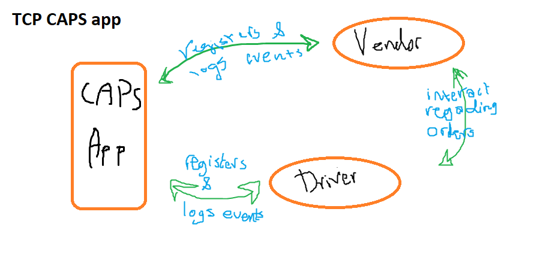

# LAB-17

## Project: CAPS server

## Author: Darah

## Links and Resources

### submission PR 

[TCP](https://github.com/Darah98/caps/pull/2)

## Setup

### .env requirements

- PORT
- STORE_NAME

### Running the app

- node caps.js
- node vendor.js
- node driver.js

### Tests

- npm run lint
- npm test

## UML

